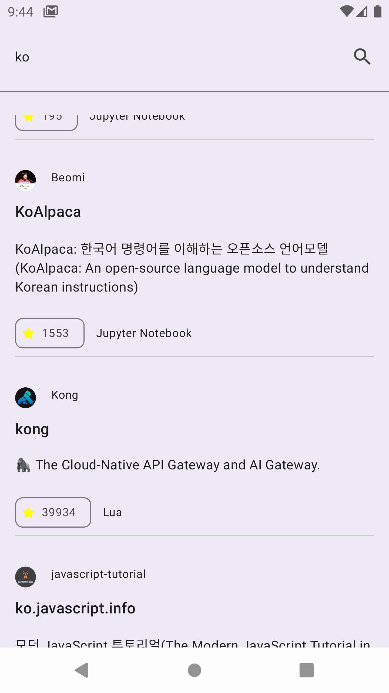
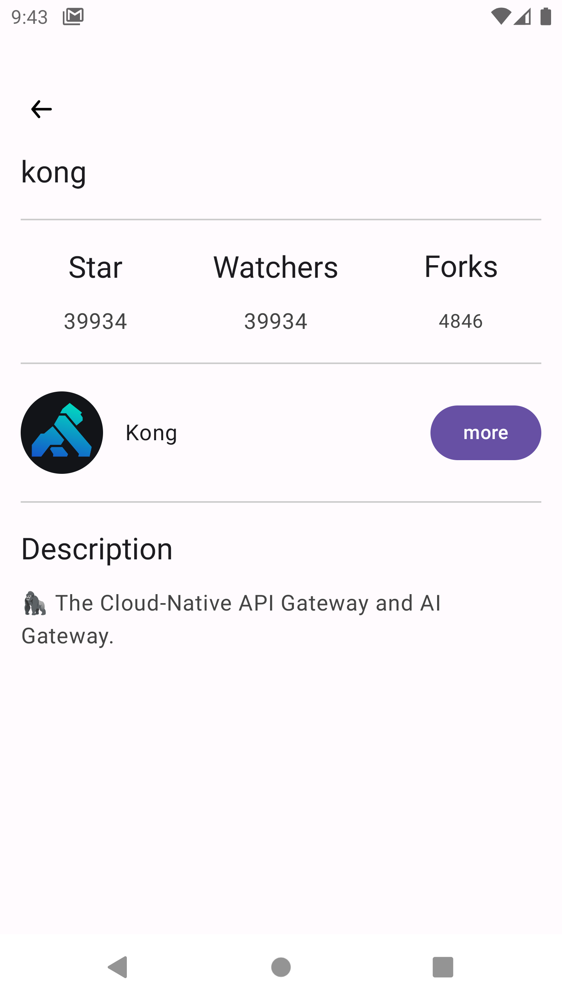

# 1. 프로젝트 구조 및 화면

안드로이드 권장 아키텍처를 참고하여 data, domain, presentation 계층으로 구성하였습니다.

```kotlin
app
├── 📂 data
│   ├── 📂 di
│   ├── 📂 entity
│   ├── 📂 repositoryImpl
│   └── 📂 service
│
│
├── 📂 domain
│   ├── 📂 model
│   ├── 📂 repository
│   ├── 📂 usecase
│   └── Util.kt
│
├── 📂 presentation
│   ├── 📂 viewmodel
│   ├── 📂 view
│   ├── 📂 contract // MVI패턴 적용을 위한 UiEvent, State, Effect 정의
│   ├── 📂 navigation
│   └──📂 ui
│       ├── 📂 component
│       └── 📂 theme
│
│
└── Application.kt
```

|  | |  |

# 2. 패턴

### MVI 패턴 적용

**< 적용 배경 >**

MVI (Model-View-Intent) 패턴을 적용하여 이벤트, 상태, 효과를 명확하게 분리하고, 일관된 UI 상태 흐름을 유지하도록 했습니다.

**< 고려 사항 >**

1. 명확한 사용자 이벤트 정의: sealed interface를 활용하여 Screen에서 Viewmodel로 전달되는 이벤트를 정의했습니다.
2. 상태 관리 최적화: StateFlow를 활용하여 UI가 항상 최신 상태를 구독하도록 설정하였습니다.
3. 사이드 이펙트 정의 및 관리: sealed interface를 활용하여 Viewmodel에서 Screen으로 전달되는 사이드 이펙트를 정의했습니다.

# 3. 성능 최적화

## 비동기 처리

### Github API 요청 비동기 병렬처리를 통한 2차 속도 제한 오류(403: Secondary Rate Limit) 방지

**< 적용 배경 >**

상세페이지에서 사용자의 사용 언어 리스트, 총 레포지토리 개수를 노출하기 위해서 <u>사용자의 레포지토리 리스트 조회 API에 적용</u>했습니다.
해당 API는 페이징 처리되어 있어, 첫 페이지부터 마지막 페이지까지 요청을 보낸
후 전체 레포지토리의 수와 사용된 언어를 구하는 방식으로 구현했습니다.

이 로직은 GetRepositoryAndLanguageUseCase.kt에서 구현되었으며, <u>연속 API 요청을 최소 1회, 최대 100회 수행</u>해야 했습니다.

<u>이 과정에서 API 요청이 잦아지면서 GitHub 속도 제한 오류가 발생하여 개선이 필요했습니다.</u>

따라서 GitHub API 요청을 비동기 병렬 처리하여, 속도 제한 오류를 예방하고 발생 확률을 줄이는 방식을 적용하게 되었습니다.

**< 고려 사항 >**

1. <u>5개씩 페이지 요청을 묶어(chunked) 병렬 실행</u>하여 한 번에 너무 많은 요청이 전달되지 않도록 조정했습니다.
2. <u>비동기 요청`async`을 수행할 때, 각 요청 간 `500ms` 딜레이를 추가</u>해 속도 제한을 피했습니다.
3. <u>일부 요청이 실패해도 전체 요청이 중단되지 않도록 설계</u>하여 가능한 많은 데이터를 확보할 수 있도록 했습니다.

**< 중요 코드 >**

domain/useCase/GetRepositoryAndLanguageUseCase.kt

```kotlin
(2..lastPage).chunked(5).forEach { batch -> //5개의 페이지씩 병렬요청
    val responses = batch.map { page ->
        async {
            delay(500) //500ms 딜레이 적용
            repository.getUserRepositories(userName, page)
        }
    }.awaitAll()

    responses.forEach { response ->
        //중간 응답이 실패하더라도 멈추지 않고, 일단 그 다음 응답이 성공할 경우 레포지토리 리스트를 갱신하도록 함
        when (response) {
            is ApiResponse.Success -> {
                repositories.addAll(response.data)
                isSuccess = true
            }

            is ApiResponse.Error -> {
                error = ErrorMessage(response.code, response.message)
            }

            is ApiResponse.Exception -> {
                throwable = Exception(response.exception)
            }
        }
    }
}
```

### 검색어 입력 시 Debounce 적용으로 API 호출 최적화

**< 적용 배경 >**

SearchBar의 쿼리가 바뀔 때마다 API 요청이 실행되면서 불필요한 요청이 쌓이는 문제를 개선했습니다.
Debounce 기법을 적용하여 <u>연속적인 입력 중 특정 시간(700ms) 동안 변화가 없을 때만 API 요청을 보내도록 최적화</u>했습니다.

**< 고려 사항 >**

1. 마지막 입력 후 700ms가 지나야 API 요청이 실행되도록 설정했습니다.
2. 검색어가 공백일 경우 API 호출을 제한했습니다.
3. snapshotFlow를 사용하여 SearchBar 컴포넌트가 반환하는 query 상태변화를 Flow로 변환했습니다.

**< 중요 코드 >**

presentation/view/SearchRepositoryScreen.kt

```kotlin
val searchWord = remember { mutableStateOf(uiState.value.searchInput) }
val searchResult = viewModel.getSearchPagingResult(uiState.value.searchInput)?.collectAsLazyPagingItems()
val textFlow = remember { snapshotFlow { searchWord.value } }

LaunchedEffect(textFlow) {
    textFlow.debounce(700).filter { it.isNotBlank() }
        .collect { viewModel.handleEvent(SearchRepositoryEvent.ChangeSearchWord(it)) }
}
Scaffold(
    modifier = Modifier.fillMaxSize(),
) { innerPadding ->
    SearchBar(
        query = searchWord.value,
        onQueryChange = {
            searchWord.value = it
        },
        onSearch = { viewModel.handleEvent(SearchRepositoryEvent.ChangeSearchWord(it)) },
        //... 중략 ...
    ) {
        //...중략...
    }
}
```

### api 비동기 요청

**< 적용 배경 >**

상세 페이지에서 데이터 초기화에 총 세 가지 API 요청을 사용했습니다. <u>단일 레포지토리 조회, 레포지토리 리스트 조회, 사용자 정보 조회는 서로 의존성이 없는 독립적인 suspend 함수이므로, 각각 별도의
코루틴에서 실행하여 병렬로 처리했습니다.</u> 이를 통해 전체적인 응답 시간을 효과적으로 단축할 수 있었습니다.

**< 고려 사항 >**

1. IO 작업을 수행하는 코루틴에서 유스케이스 호출(api요청 및 비즈니스 로직을 실행)하여 UI 응답성을 유지했습니다.

**< 중요 코드 >**

presentation/viewmodel/RepositoryViewmodel.kt

```kotlin
override fun handleEvent(event: RepositoryEvent) {
    when (event) {
        is RepositoryEvent.GetRepository -> {
            viewModelScope.launch(Dispatchers.IO) {
                launch { getRepository(userName = event.userName, repository = event.repository) }
                launch { getUser(event.userName) }
                launch { getRepositoryCountsAndLanguage(event.userName) }
            }
        }

        RepositoryEvent.ClickBackButton -> setEffect(RepositoryEffect.NavigateToBack)
        RepositoryEvent.ClickUserMore -> setState { copy(isModalExpanded = !currentState.isModalExpanded) }
    }
}

private suspend fun getUser(userName: String) {
    val userResult = getUserInfoUseCase(userName = userName)
    withContext(Dispatchers.Main) {
        handleError(apiResponse = userResult) { isLoading, isError, errorMessage, data ->
            //상태업데이트
            when {
                isError -> this.copy(isLoading, isError, errorMessage, user = data) //에러
                data != null -> this.copy(isLoading, isError, errorMessage, user = data) //성공
                else -> this
            }
        }
    }
}
```

## UI 최적화

### pager key값 적용

**< 적용 배경 >**

레포지토리 검색 결과를 확인하는 기능은 Paingin 라이브러리를 통해 구현했으며, LazyColumn에 key값을 적용했습니다.

불필요한 리컴포지션을 방지하고 기존 항목을 재사용하여 UI 업데이트를 최소화하며, 리스트 렌더링 성능을 최적화하기 위해 적용되었습니다.

**< 고려 사항 >**

1. key값의 고유성을 위해서 'userName/repositoryName' 형태로 key를 생성하였습니다.
2. searchResult[index]가 null일 경우 key값으로 'unknown_user_{index}/unknown_repo_{index}'를 설정하여 중복 key값으로 인한 오류를 방지하였습니다.

**< 중요 코드 >**

presentation/view/SearchRepositoryScreen.kt

```kotlin
LazyColumn(modifier = Modifier.padding(innerPadding)) {
    items(
        searchResult.itemCount,
        key = { index ->
            val userName = searchResult[index]?.userName ?: "unknown_user_$index"
            val repoName = searchResult[index]?.repositoryName ?: "unknown_repo_$index"
            "$userName/$repoName"
        }) { index ->
        //...중략
    }
}
```

### strong skipping mode 적용

**< 적용 배경 >**

불필요한 리컴포지션을 방지하기 위해 Strong Skipping Mode를 적용하였으며, 이를 위해 Kotlin Compiler 1.5.7 버전을 사용했습니다.

**< 고려 사항 >**

Strong Skipping Mode가 예상과 다르게 동작할 가능성이 있어, 반복적인 디바이스 테스트를 통해 정상적으로 동작하는지 검증했습니다.

# 그 외 고려사항

### 응답 래퍼클래스 정의 및 에러코드 메세지 매핑

**< 적용 배경 >**

API 응답 처리의 일관성을 유지하기 위해 네트워크 요청의 성공, 실패(에러 및 예외)를 sealed class ApiResponse<T>로 래핑하여 반환했습니다.

**< 고려 사항 >**

1. 사용자 친화성 고려: 응답으로 받은 에러 코드를 키 값으로 ErrorType의 한국어 메시지와 매핑하여 사용자 친화성을 높였습니다.
2. 응답 헤더 Link 값 반환 고려: GitHub API 중 페이징 처리가 필요한 일부 엔드포인트를 사용하기 위해, 응답 헤더의 Link를 파싱하여 nextPage 및 lastPage 값을 추출해 활용했습니다.
   이에 따라, 요청이 성공하면 제네릭 타입의 데이터뿐만 아니라 LinkHeader 문자열도 함께 반환하도록 설계했습니다.

**< 중요 코드 >**

domain/entity/entity.kt

사용한 API에서 발생할 수 있는 특정 에러 코드만 매핑했습니다.

```kotlin
object ErrorType {
    private val errorMap = mapOf(
        301 to "리다이렉션 오류",
        304 to "캐시된 응답을 사용하세요",
        403 to "접근 권한이 없습니다",
        404 to "요청한 리소스를 찾을 수 없습니다",
        503 to "서비스가 일시적으로 중단되었습니다"
    )

    fun fromCode(code: Int): String = errorMap[code] ?: "예기치 않은 오류가 발생했습니다:("
}
```

domain/entity/ApiResponse.kt

```kotlin
sealed class ApiResponse<out T> {
    data class Success<T>(val data: T, val linkHeader: String?) : ApiResponse<T>()
    data class Error(val code: Int, val message: String) : ApiResponse<Nothing>()
    data class Exception(val exception: Throwable) : ApiResponse<Nothing>()
}

suspend fun <T> safeApiCall(apiCall: suspend () -> Response<T>): ApiResponse<T> {
    return try {
        val response = apiCall()

        if (response.isSuccessful) {
            val body = response.body()
            if (body != null) {
                return ApiResponse.Success(body, response.headers()["Link"])
            } else {
                return ApiResponse.Error(response.code(), "Response body is null")
            }
        }

        ApiResponse.Error(response.code(), ErrorType.fromCode(response.code()))

    } catch (e: HttpException) {
        ApiResponse.Error(e.code(), e.message())
    } catch (e: IOException) {
        ApiResponse.Exception(e)
    } catch (e: Exception) {
        ApiResponse.Exception(e)
    }
}
```

domain/Util.kt

페이징 API 사용시 필요한 nextPage, lastPage 값을 Link로부터 파싱합니다.

```kotlin
fun extractNextKey(linkHeader: String): Int? {
    val nextUrl = linkHeader
        .split(",")
        .find { it.contains("rel=\"next\"") }
        ?.substringAfter("<")
        ?.substringBefore(">")

    val nextKey = nextUrl?.let { url ->
        Regex("page=(\\d+)").find(url)?.groupValues?.get(1)?.toInt()
    }
    return nextKey
}

fun extractLastKey(linkHeader: String): Int? {
    val nextUrl = linkHeader
        .split(",")
        .find { it.contains("rel=\"last\"") }
        ?.substringAfter("<")
        ?.substringBefore(">")

    val nextKey = nextUrl?.let { url ->
        Regex("page=(\\d+)").find(url)?.groupValues?.get(1)?.toInt()
    }
    return nextKey
}
```
